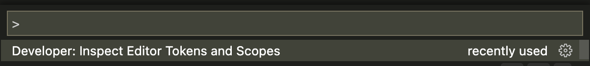
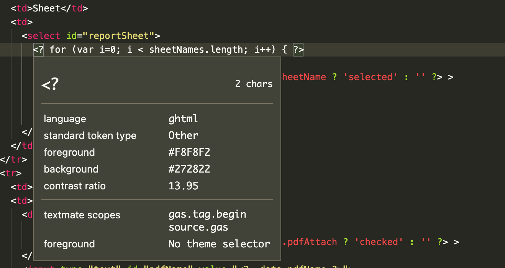
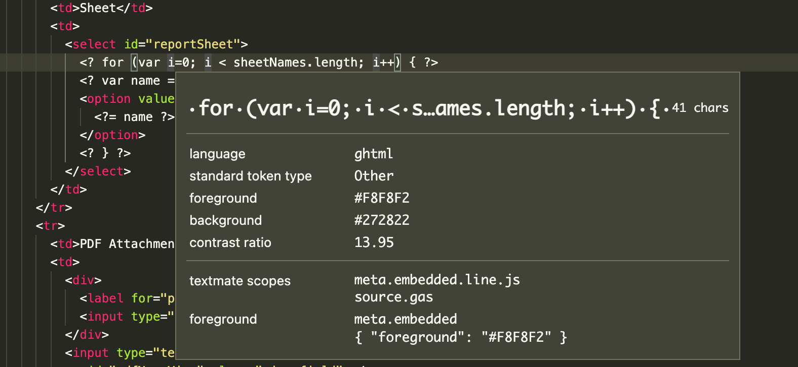
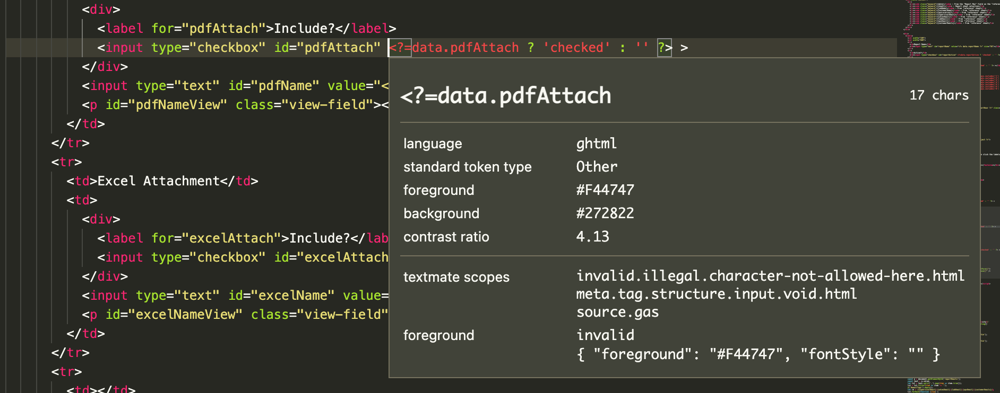

# gas-html

Work in progress! Help and feedback welcome.

Trying to create vs-code language extension for Google App Script (GAS) html templates.

See:

- https://code.visualstudio.com/api/language-extensions/syntax-highlight-guide
- https://developers.google.com/apps-script/guides/html/templates

## Usage

Copy and paste into the `<user home>/.vscode/extensions` folder and restart Code.

This will add a new language, "gas-html", with file extensions `.ghtml` and `.gas-html`. If you're editing a regular `html` file, you can still click the language in the bottom right of the editor and specify that the file is actually `gas-html.`

## Status

### Auto-completion

By adding `<? ... ?>` and `<?= ... ?>` into the brackets/pairs definitions in `language-configuration.json` those brackets will automatically close when editing gas-html files. So that's neat....

### Token Parsing

If you open the command pallete and search "Developer: Inspect Editor Token and Scopes" you can see how the html is being parsed.

You can see that `<? ... ?>` snippets that are not in a special context get new tags:

- `gas.tag.begin` at the start
- `gas.tag.end` at the end
- `meta.embedded.line.js` in between

| Tokens Start                  | Tokens Middle                  |
| ----------------------------- | ------------------------------ |
|  |  |

I think this is a good start! But it the parsing gets messed up if the gas tags appear in other contexts, like within an html tag or javascript section.

## Dev

See [vsc-extension-quickstart.md](./vsc-extension-quickstart.md) for more development instructions.
